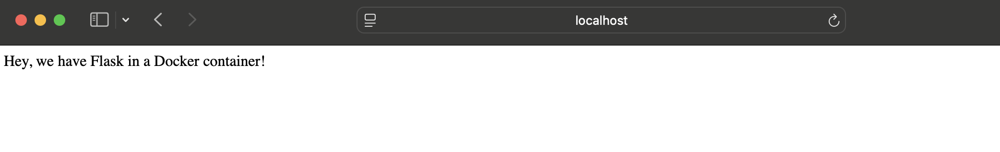

# Dockerized Flask App (Lambda Server)

A minimal Flask web app running inside a Docker container on the lambda server.  
The container exposes Flask’s internal port 5000 to a unique host port (e.g., `$UID`) and is accessed from my laptop via SSH local port forwarding.

## Screenshot

